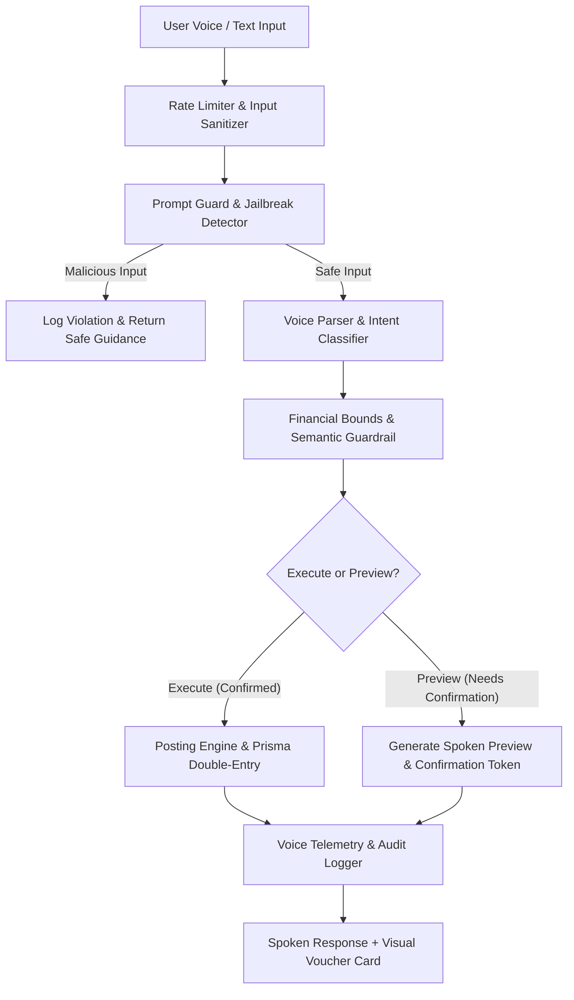

# Voice AI Agent Refactoring, Guardrails, Observability & Evaluation Suite

Comprehensive implementation to upgrade the Voice AI Agent (`VoiceParser.ts`, `VoiceAgentService.ts`, `VoiceController.ts`, `VoiceAgentModal.tsx`) with **Production AI Guardrails**, **Prompt Injection Defense**, **Structured Observability**, **Automated Evals Benchmark**, and **Two-Step Reconfirmation Workflows**.

## User Review Required

> [!IMPORTANT]
> **Safety Guardrails & Two-Step Reconfirmation**:
> 1. **Prompt Injection & Adversarial Defense**: Detects and neutralizes jailbreak attempts (e.g., *"Ignore previous instructions"*, *"System override"*, *"Reveal secret keys"*, *"Drop database"*), returning safe guidance without executing malicious or out-of-domain commands.
> 2. **Financial Bounds Guardrails**: Validates all amounts ($0 < \text{Amount} \le ₹10,00,00,000$), enforces double-entry invariance ($Debit \equiv Credit$), and blocks negative posting attacks.
> 3. **Two-Step Reconfirmation**: All ledger mutations require explicit preview & confirmation before writing to PostgreSQL.

---

## Architecture & Proposed Changes



---

### 1. AI Safety & Prompt Injection Guardrails (`backend/src/modules/voice/security/PromptGuard.ts`)
- **Jailbreak Detection**: Scans for system override, instruction ignoring, role reversal, privilege escalation, and code injection (`<script>`, SQL injection, template interpolation).
- **Safe Fallback**: Neutralizes attempts safely, logs security events, and returns structured friendly responses without crashing or revealing internals.

### 2. Financial Safety Guardrails (`backend/src/modules/voice/security/FinancialGuardrails.ts`)
- **Range & Value Checks**: Strict validation ($0.01 \le \text{Amount} \le 10,00,00,000$).
- **Anti-Tampering**: Checks for NaN, Infinity, negative values, and invalid currency characters.
- **High-Value Alerts**: Flags transactions $> ₹1,00,000$ with mandatory high-value confirmation warnings.

### 3. Voice Observability & Telemetry (`backend/src/modules/voice/observability/VoiceTelemetry.ts`)
- **Latency Tracking**: Measures parse latency, database latency, and end-to-end execution time.
- **Intent & Safety Metrics**: Tracks intent distributions, guardrail trigger rates, and confirmation success rates.
- **Structured Audit Logging**: Emits structured JSON events with correlation IDs for every voice interaction.

### 4. Voice Parser & Service Refactoring (`VoiceParser.ts` & `VoiceAgentService.ts`)
- **Modular Code Design**: Refactored into clean helper classes with explicit TypeScript types, comments, and Hinglish / Indian accounting vocabulary (`k`, `lakh`, `lac`, `crore`, `cr`, `rupees`, `rs`, `₹`, `bucks`).
- **Confirmation Intent Support**: Handles affirmative voice responses (*"yes"*, *"confirm"*, *"proceed"*, *"record it"*) and cancellation responses (*"cancel"*, *"nevermind"*, *"no"*).
- **Two-Step Preview Mode**: Default `execute: false` creates structured voucher preview with spoken confirmation question; posting only happens upon confirmed approval.

### 5. Frontend Voice Modal UI (`VoiceAgentModal.tsx` & `.css`)
- **Interactive Reconfirmation Card**: Visually displays pending vouchers with Dr/Cr accounts, formatted amounts, and interactive **"✓ Confirm & Post"** and **"✕ Cancel"** buttons.
- **Spoken Audio Status & Wave Animations**: Clear visual indicators when listening, processing, speaking, or awaiting confirmation.

### 6. Automated Evals & Comprehensive Test Suite
- **Evals Benchmark Suite** (`backend/tests/evals/VoiceAgentEval.test.ts`):
  - Benchmarks 40+ diverse conversational test cases across 4 categories:
    1. Standard Indian Accounting Queries (Bank, Cash, Net Worth, P&L, Debtors/Creditors).
    2. Double-Entry Mutations (Contra, Receipt, Payment, Journal, Credit Sales).
    3. Hinglish & Colloquial Slang (*"Rahul ko 5000 diya"*, *"1.5 lakh withdrawal"*, *"50k received"*).
    4. Adversarial & Prompt Injection Attacks (*"Ignore instructions"*, SQL strings, negative numbers, script injections).
  - Asserts accuracy thresholds ($> 95\%$ intent classification precision, $100\%$ prompt injection mitigation, $100\%$ double-entry balance).
- **Unit & Integration Tests**:
  - `backend/tests/unit/VoiceParser.test.ts`
  - `backend/tests/unit/PromptGuard.test.ts`
  - `backend/tests/integration/VoiceAgent.test.ts`

---

## Verification Plan

### Automated Tests
```bash
# 1. Run Backend Unit & Integration Tests
cd backend && npm test

# 2. Run Voice AI Evals Benchmark
cd backend && npx vitest run tests/evals/VoiceAgentEval.test.ts

# 3. Run Full QA Suite
cd backend && npm run qa

# 4. Run Frontend Tests
cd frontend && npm test
```

### Manual Verification
- Test spoken transactions in the browser and verify the 2-step reconfirmation card.
- Verify prompt injection attempts are gracefully blocked and logged.
- Verify that posting transactions updates account balances and maintains $Debit \equiv Credit$.
